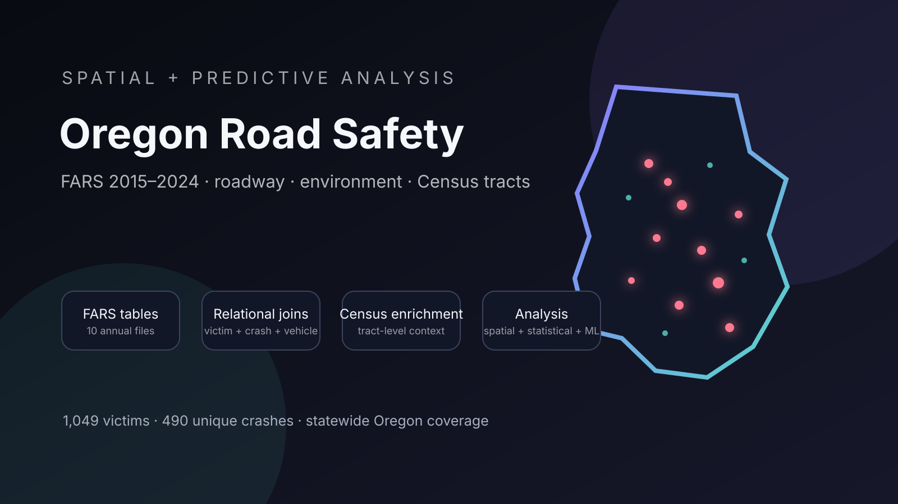

::: {.project-hero .reveal}

CAPSTONE · SPATIAL ANALYSIS · MACHINE LEARNING

# Fatal Pedestrian and Cyclist Crash Risk Factors in Oregon

A spatial and predictive analysis designed to help transportation planners identify where fatal non-motorist crashes occur and which conditions are most strongly associated with them.

::: {.project-meta}
<strong>Role</strong> Statistical analysis, machine learning, interpretation, and communication
<strong>Team</strong> Simon Thompson and Rohan Srinivasa Babu
<strong>Period</strong> 2015–2024 data
:::

[View repository](https://github.com/S1mT/data510-OregonPedSafety){.btn .btn-primary}
[Download write-up](writeup.pdf){.btn .btn-outline-light}
:::

## The one-liner

> We integrated **ten years of Oregon fatal crash records from NHTSA's Fatality Analysis Reporting System with roadway, environmental, and Census tract data** into **a single analysis-ready dataset of fatal pedestrian and cyclist crashes** so that **transportation planners and safety agencies** can **identify high-risk conditions and better prioritize safety investments**.

## The question

Pedestrians and cyclists are among the most vulnerable users of the transportation system, yet limited safety funding means agencies must decide where interventions are most urgently needed.

Our primary research question asks: **Which environmental, roadway, and temporal factors are most strongly associated with fatal pedestrian and cyclist crashes in Oregon between 2015 and 2024?**

We also examine whether fatal crashes are disproportionately concentrated in communities with certain demographic or socioeconomic characteristics.

## The data

The project uses the National Highway Traffic Safety Administration's Fatality Analysis Reporting System, or FARS, covering Oregon fatal crashes from 2015 through 2024.

The raw FARS database is relational, so a single victim record must be assembled from several annual files:

- `person.csv` for victim characteristics
- `pbtype.csv` for pedestrian and bicyclist positioning
- `accident.csv` for crash location, lighting, roadway, and temporal conditions
- `weather.csv` for reported weather conditions
- `vehicle.csv` for speed limit, traffic controls, and roadway configuration associated with the striking vehicle

The first stage joins these records into `FARSinfrastructure.csv`. The second stage spatially assigns each crash to a Census tract and enriches it with American Community Survey variables such as median income, population characteristics, and commute mode. The final `FARSmaster.csv` dataset contains **1,049 fatal pedestrian and cyclist victim records across 490 unique crashes**.

The most difficult part of the engineering process was preserving the correct relationships across crash, vehicle, and person records. Pedestrian records do not directly contain the relevant vehicle infrastructure fields, so the pipeline maps each victim's striking-vehicle identifier to the corresponding vehicle record.

## The approach

We structured the analysis around four connected components:

1. Exploratory analysis of victim, temporal, environmental, and roadway patterns.
2. Spatial methods to examine where fatal crashes concentrate.
3. Statistical testing across categorical roadway, environmental, and demographic variables.
4. Interpretable machine-learning models, including Random Forest, to rank influential variables.

Because every observation in FARS already involves a fatality, the project does not claim to predict whether a crash becomes fatal. It examines patterns within fatal pedestrian and cyclist crashes and identifies the conditions most frequently associated with them.

## Findings

{fig-alt="Diagram showing the FARS data pipeline from raw annual crash tables through infrastructure joins, Census enrichment, and spatial and predictive analysis" width="90%"}

The analysis-ready dataset shows that fatal non-motorist crashes in Oregon are predominantly pedestrian crashes and are heavily concentrated in urban environments.

- 881 pedestrians
- 124 bicyclists
- 44 other pedalcyclists or personal-conveyance users
- 863 urban records
- 185 rural records

Traffic-control information is unreported for approximately 57% of records, while speed-limit information is unavailable for approximately 24%. These gaps reduce how confidently those variables can be interpreted.

Spatial, statistical, and machine-learning findings are still being finalized. Conclusions will be limited to fatal crashes recorded in FARS and should not be interpreted as estimates of total pedestrian or cyclist risk.

## Full write-up

::: {.pdf-shell}
<iframe src="writeup.pdf" width="100%" height="850px" title="Oregon pedestrian and cyclist safety capstone write-up"></iframe>
:::

## Dig deeper

- **Code and pipeline:** [data510-OregonPedSafety](https://github.com/S1mT/data510-OregonPedSafety)
- **Data summary:** [View the project repository](https://github.com/S1mT/data510-OregonPedSafety)
- **Poster:** Final poster link will be added after completion
